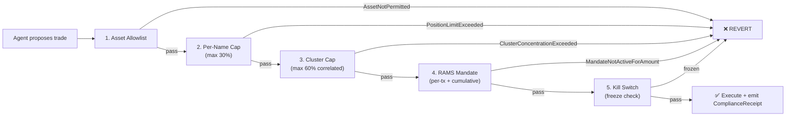
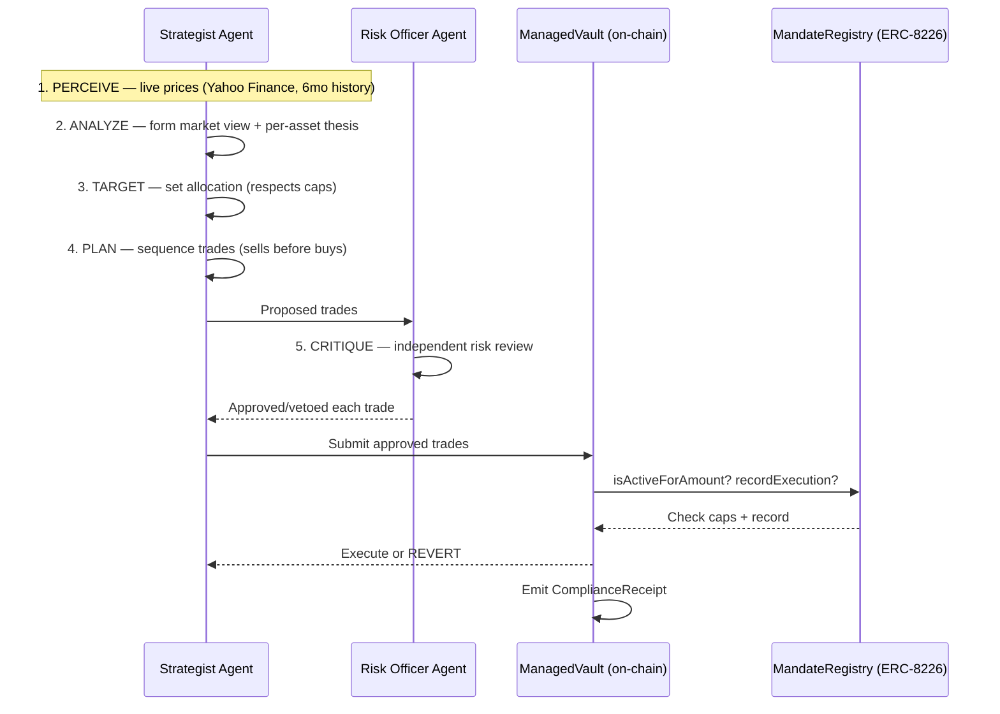

<div align="center">

# MANDATE

[](LICENSE)
[](https://eips.ethereum.org/EIPS/eip-8226)
[](https://docs.robinhood.com/chain/)
[](mandate/test/)
[](https://openhouse.arbitrum.io/)

**AI manages your stocks. The contract enforces the rules.**

*The first implementation of ERC-8226 (Regulated Agent Mandate) — a two-agent AI system that trades tokenized equities on Robinhood Chain under cryptographic mandate enforcement. Every trade is checked atomically. Violations revert on-chain. No exceptions.*

[Live Demo](https://mandate-xi.vercel.app/) · [Explorer (Vault)](https://explorer.testnet.chain.robinhood.com/address/0x4eE0dC79A8f6914a8D41c1278a800485Ca01763C) · [ERC-8226 Standard](https://eips.ethereum.org/EIPS/eip-8226)

</div>

---

## The problem nobody's solved

Tokenized equities just went live on Robinhood Chain. TSLA, AMZN, PLTR, AMD — real stocks, represented as ERC-20 tokens on an Arbitrum Orbit L2. AI agents are going to manage these portfolios. That's inevitable.

Here's the gap: **no compliance officer on earth will hand a regulated security to an unconstrained bot.** Today you either trust the AI completely, or you don't use it.

Existing on-chain asset management (Enzyme since 2019, dHEDGE since 2020) enforces vault policies for crypto funds — but neither has a *regulated agent mandate* model. No KYC gate. No jurisdiction scoping. No examiner-ready audit trail. No regulator kill switch.

And the regulatory pressure is live:
- **SEC Joint Staff Statement (Jan 2026):** tokenized equities are securities, full stop.
- **SEC Crypto Task Force (Feb 2026):** demands "examiner-ready mandates with defined risk limits, kill authority, and change control" for all algorithmic agents managing securities.
- **ERC-8226 (Apr 2026):** a new Ethereum standard for exactly this — Regulated Agent Mandate Standard (RAMS). Status: Draft. **Reference implementation slot: empty.**

We fill that slot.

---

## What Mandate does

A capital owner deposits USDG + stock tokens into a managed vault and hires an AI to manage the equity portfolio. The vault encodes the mandate — allowed assets, position caps, a correlated-cluster limit, spending caps, and a regulatory kill switch. After one signature, the AI trades autonomously. But every trade passes through **five enforcement layers, checked atomically by the smart contract** before any value moves.

If the AI tries to break the rules, the chain reverts. Not the code. The chain.

```
Owner signs mandate (once)
    → AI perceives live market data
    → AI analyzes (Strategist agent)
    → AI sets target allocation (mandate-bounded)
    → AI plans trade sequence
    → Risk Officer agent reviews (independent veto)
    → Valid trades execute through the vault
    → Contract emits ComplianceReceipt (examiner-ready)
    → Invalid trades REVERT with specific errors
```

---

## The five enforcement layers

Every agent buy is checked against all five, in order. Hard guarantees are **oracle-free** (token base units), per ERC-8226's rationale for avoiding price-oracle manipulation.



The **correlation-cluster cap** is the differentiator no one else has: five tech stocks that move together can't masquerade as diversification. The contract knows TSLA+AMZN+PLTR+AMD are correlated and caps their combined exposure at 60% — regardless of how many names the agent spreads across.

---

## The agentic system — not a chatbot wrapper

This is a genuine multi-agent reasoning loop, not a single LLM prompt.



| Capability | How it works |
|---|---|
| **Live market data** | Real prices from Yahoo Finance (TSLA $391, AMZN $246, PLTR $135, AMD $466). Momentum, volatility, valuation computed from 6 months of daily closes. `[LIVE]` source badge proves it's real. |
| **Two-agent coordination** | Strategist forms the view; a separate Risk Officer agent independently vets every trade and can veto. Different system prompts, different concerns. |
| **Cross-cycle memory** | Each cycle is persisted. The agent references its prior stance and computes allocation drift to avoid churn. |
| **Self-critique loop** | The agent rejects its own violating trades *before* the contract does — a competent agent never knowingly submits a bad trade. |
| **Transparent reasoning** | Every phase renders in the UI: perceive → analyze → target → plan → critique → explain. The reasoning chain IS the product. |

---

## Deployed and verified on Robinhood Chain testnet

| Contract | Address | Verified |
|----------|---------|----------|
| **MandateRegistry** (ERC-8226) | [`0xc6d4A15CcCd924a66F959684E3D370e6B9dc8B2c`](https://explorer.testnet.chain.robinhood.com/address/0xc6d4A15CcCd924a66F959684E3D370e6B9dc8B2c) | ✓ |
| **ComplianceProvider** (ERC-8226) | [`0x4A465D355E6913BBC071388D0E0808160F60c02F`](https://explorer.testnet.chain.robinhood.com/address/0x4A465D355E6913BBC071388D0E0808160F60c02F) | ✓ |
| **ManagedVault** | [`0x4eE0dC79A8f6914a8D41c1278a800485Ca01763C`](https://explorer.testnet.chain.robinhood.com/address/0x4eE0dC79A8f6914a8D41c1278a800485Ca01763C) | ✓ |

**Happy path proven:** 25,000 USDG → TSLA executed successfully within all mandate bounds → [`0x3d25b2a7...`](https://explorer.testnet.chain.robinhood.com/tx/0x3d25b2a7232a70a49fa4f13f8fc3c239aceabce9b1bcc3d28267021de3a526dd)

**Four reverts proven:** AssetNotPermitted · PositionLimitExceeded · ClusterConcentrationExceeded · MandateNotActiveForAmount — each demonstrated live against the deployed contracts.

---

## Honest prior art (because overclaiming loses)

On-chain vaults that enforce allowed-asset/position-limit policies are **not novel.** Enzyme (2019) and dHEDGE (2020) pioneered this. We cite them explicitly.

What IS new here — the defensible recombination:
1. **First ERC-8226 implementation** — a brand-new standard (Draft, Apr 2026), reference impl slot empty.
2. **Tokenized equities, not crypto** — different asset class, different regulatory requirements.
3. **Robinhood Chain** — the sponsor's flagship RWA chain, using their real token addresses.
4. **Correlation-aware cluster cap** — catches fake diversification; no one else does this.
5. **Two-agent reasoning with live data + memory** — not a demo bot, a genuine autonomous system.
6. **Examiner-ready compliance receipts** — on-chain audit trail matching SEC Crypto Task Force demands.
7. **Regulatory kill switch with tiered enforcement** — platform vs regulatory, jurisdiction-scoped vs global.

---

## Run it locally

```bash
git clone https://github.com/Nidhicodes/Mandate
cd Mandate

# ── Contracts (Foundry) ──
cd contracts
forge build
forge test                    # 33 tests, every revert path

# ── Agent service ──
cd ../agent
npm install
cp .env.example .env          # fill: RPC, contract addresses, GROQ_API_KEY
npm start                     # http://localhost:3002

# ── Frontend ──
cd ../frontend
npm install
npm run dev                   # http://localhost:3000
```

Open the dashboard → click "Run Agent" → watch the 6-phase reasoning chain with live market data → click enforcement buttons → watch on-chain reverts.

---

## Architecture

```
mandate/
├── contracts/                 Solidity (Foundry)
│   ├── src/
│   │   ├── interfaces/
│   │   │   ├── IAgentMandate.sol        ERC-8226 interface
│   │   │   └── IComplianceProvider.sol  ERC-8226 interface
│   │   ├── MandateRegistry.sol          Full ERC-8226 implementation
│   │   ├── ComplianceProvider.sol       KYC/eligibility with reason codes
│   │   └── ManagedVault.sol             5-layer enforcement + compliance receipts
│   ├── test/                            33 tests, every revert path
│   └── script/                          Deploy + fund + grant mandate
│
├── agent/                     TypeScript (Node.js)
│   └── src/
│       ├── agent.ts           6-phase reasoning loop (Strategist + Risk Officer)
│       ├── signals.ts         Live Yahoo Finance data + fallback
│       ├── memory.ts          Cross-cycle persistence + drift detection
│       ├── executor.ts        On-chain reads + trade submission + revert decoding
│       ├── manager.ts         Single-trade proposer (legacy, kept for /api/propose)
│       └── server.ts          Express API: plan · execute · demo/revert · receipts
│
├── frontend/                  Next.js + Tailwind
│   └── app/page.tsx           Hero · Problem · Architecture · Live Demo · Receipts
│
└── README.md                  ← you are here
```

---

## Tech stack

| Layer | Choice | Why |
|---|---|---|
| Standard | **ERC-8226** (Regulated Agent Mandate) | First implementation of a real EIP |
| Contracts | **Solidity 0.8.28 · Foundry · OpenZeppelin** | 33 tests, NatSpec, verified on explorer |
| Chain | **Robinhood Chain Testnet** (Arbitrum Orbit, ID 46630) | Sponsor's flagship tokenized-equity L2 |
| AI Agents | **Groq (Llama 3.3 70B)** + multi-agent loop | Strategist + Risk Officer, live data + memory |
| Market data | **Yahoo Finance** (live, 6-month history) | Real prices, computed momentum/volatility/valuation |
| Frontend | **Next.js · Tailwind · TypeScript** | Dark theme, 3D card flip, scroll-driven reveals |
| Deploy | **Vercel (frontend) · Render/Railway (agent)** | Live URL for judges |

---

## The compliance receipt is the product

Every executed trade emits a `ComplianceReceipt` event on-chain:

```solidity
event ComplianceReceipt(
    uint256 indexed agentId,
    address indexed principal,
    address indexed asset,
    Action  action,
    uint256 amountIn,
    uint256 amountOut,
    bytes32 mandateScopeHash
);
```

This is an **examiner-ready audit trail** — not a database log, not an API response, a cryptographic record on an immutable chain. A compliance officer or regulator can independently replay every agent action against the mandate and verify no breach occurred, without trusting the agent, the platform, or anyone's word.

---

## Demo: the reverts ARE the thesis

The enforcement demo doesn't just show that things work. The reverts *are* the value proposition. Each one proves a specific guarantee:

| Button | What it attempts | What the contract does | Why it matters |
|--------|-----------------|----------------------|---------------|
| Buy NFLX | acquire a non-permitted asset | `AssetNotPermitted` revert | the agent can't expand its universe |
| 50% TSLA | exceed per-name concentration | `PositionLimitExceeded` revert | no single-stock blowup |
| Fill cluster >60% | overload correlated names | `ClusterConcentrationExceeded` revert | fake diversification caught |
| Exceed budget | spend past the mandate cap | `MandateNotActiveForAmount` revert | the budget is real and finite |

No amount of AI reasoning, prompt injection, or agent cleverness can override these. **The guarantee lives at the EVM execution layer**, not in code the agent controls.

---

## Where Mandate fits

| Existing approach | What it does | The gap |
|---|---|---|
| Enzyme Finance | vault policies for crypto funds | no regulated-mandate standard, no KYC, no kill switch |
| dHEDGE | non-custodial trading with guardrails | same — crypto-native, no equity compliance model |
| Session keys (ERC-7715) | scoped signer permissions | no financial caps, no compliance receipts, no correlation risk |
| The other "Mandate" | bespoke policy engine, session key constraints | custom design, not a standard; single demo agent, no multi-agent reasoning |
| **This Mandate** | **ERC-8226 standard + two-agent AI + correlation caps + compliance receipts** | **—** |

---

## What a production deployment looks like

This is a hackathon prototype. For production:
1. Replace the demo USDG/TSLA with real Robinhood Chain tokens (once mainnet launches).
2. Point the `ComplianceProvider` at an ERC-3643 registry or EAS attestation backend for real KYC.
3. Wire the swap router to a live DEX on Robinhood Chain (the vault architecture is router-agnostic).
4. Add a Chainlink price feed for the soft drawdown guard.
5. Deploy the agent to a TEE for verifiable inference (the ERC-8226 scope document references this path).
6. License the `MandateRegistry` to asset managers as shared compliance infrastructure.

The contracts are designed as a **primitive others build on** — not a closed product.

---

## The honest part

- **Remediation/execution uses demo tokens.** The Robinhood Chain faucet doesn't distribute USDG, so we deployed mintable demo USDG and demo TSLA. The enforcement logic is identical — the vault doesn't know or care whether the ERC-20 is "real." What's scored (contract quality, enforcement reverts) works against any token.
- **Market data is live, not from an on-chain oracle.** Yahoo Finance via HTTP, not Chainlink. For a testnet without Chainlink feeds, this is the honest approach. The hard guarantees (caps, allowlist, freeze) are oracle-free by design.
- **The AI can be wrong about allocation.** The LLM might propose a bad trade. That's fine — the contract catches it. The point is that a bad proposal from the AI *cannot* result in a mandate breach, because the chain is the final arbiter. Agent intelligence is a nice-to-have; enforcement is the guarantee.
- **Solo build.** No team, no funding. The product stands on its technical merit.

---

## License

Contracts: CC0-1.0 (matching the ERC). Agent + Frontend: MIT.

<div align="center">

*Mandate doesn't replace the asset manager. It gives capital owners the guarantee that no AI — however smart, however compromised — can break the rules they set. The chain enforces. Every time.*

</div>
